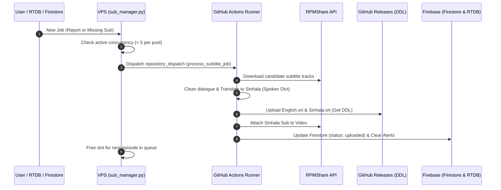

# 🌐 AniShift Subtitle Cloud Worker (`sub_manager`)

[](https://www.python.org/)
[](https://github.com/features/actions)
[](https://firebase.google.com/)
[](https://rpmshare.com/)

An ultra-high-performance, cloud-native subtitle extraction, translation, and distribution engine designed for **AniShift**. Offloads all CPU-heavy Sinhala translation operations from the VPS to GitHub Actions runners with 7 GB RAM and fresh Microsoft Azure IPs.

---

## ⚡ Key Highlights

* **10-Workflow Dual Independent Concurrency**:
  * **5 Dedicated Slots for Missing Sub Reports** (Priority 1 - Instant user feedback).
  * **5 Dedicated Slots for Auto Sub Hunter** (Priority 2 - Continuous library enhancement).
  * Neither pool blocks or starves the other!
* **Universal Translation Pipeline**:
  * Cleans dialogue, removes unwanted sponsor watermark lines.
  * Translates to natural colloquial Sinhala using the curated **Spoken Sinhala Dictionary** (`spoken_dict.py`).
  * 125-line minimum threshold scoring to filter corrupted or cracked subtitle tracks.
* **Direct Download Links (DDL)**:
  * Automatically uploads formatted `Sinhala.srt` and `English.srt` to GitHub Releases for lightning-fast direct user downloads.
* **RPMShare Video Attachment**:
  * Directly attaches translated Sinhala subtitles to the streaming video on RPMShare via REST API.
* **Zero-VPS Load**:
  * VPS runs a lightweight dispatcher daemon (~20MB RAM, 0% CPU).
  * Torrent/subtitle operations execute 100% on GitHub Cloud runners.

---

## 🏗️ Architecture Workflow



---

## 🔑 Required GitHub Actions Secrets

Add the following secret keys under your GitHub Repository **Settings -> Secrets and variables -> Actions**:

| Secret Name | Description | Example / Value |
| :--- | :--- | :--- |
| `FIREBASE_JSON` | Full contents of your `serviceAccountKey.json` | `{ "type": "service_account", ... }` |
| `FIREBASE_DB_URL` | Firebase Realtime Database URL | `https://anishift-5d14b-default-rtdb.firebaseio.com/` |
| `RPMSHARE_API_TOKEN` | Server 1 RPMShare API Token | `dea33865f43384df9ae87cd5` |
| `RPMSHARE_API_TOKEN_2` | Server 2 RPMShare API Token | `89b031f1929930a6f8296f61` |
| `SUB_GITHUB_TOKEN` | GitHub Personal Access Token (repo & workflow scope) | `ghp_...` |
| `SUB_GITHUB_REPO` | Subtitle Releases Storage Repository | `Anishift-svr/sub-vault-160633` |

---

## 📁 Repository Structure

```
├── .github/workflows/
│   └── sub_worker.yml      # GitHub Actions cloud runner definition
├── workflow.yml            # Local backup of the workflow file
├── sub_manager.py          # VPS daemon dispatcher & queue manager
├── sub_worker.py           # Cloud subtitle worker script
├── sub_engine.py           # Universal subtitle processing pipeline
├── spoken_dict.py          # Sinhala spoken vocabulary mapping
├── proxies.txt             # Optional proxy pool for Google Translate
├── .env                    # Local configuration & secrets reference
└── README.md               # Documentation
```

---

## 🚀 Running on VPS via PM2

To start the ultra-lightweight manager on your VPS:

```bash
# Start with PM2
pm2 start sub_manager.py --name "RPM-S1-SubManager" --interpreter python3

# Save configuration
pm2 save
```

---

## 🛡️ License & Credits
Developed exclusively for **AniShift**. All rights reserved.
